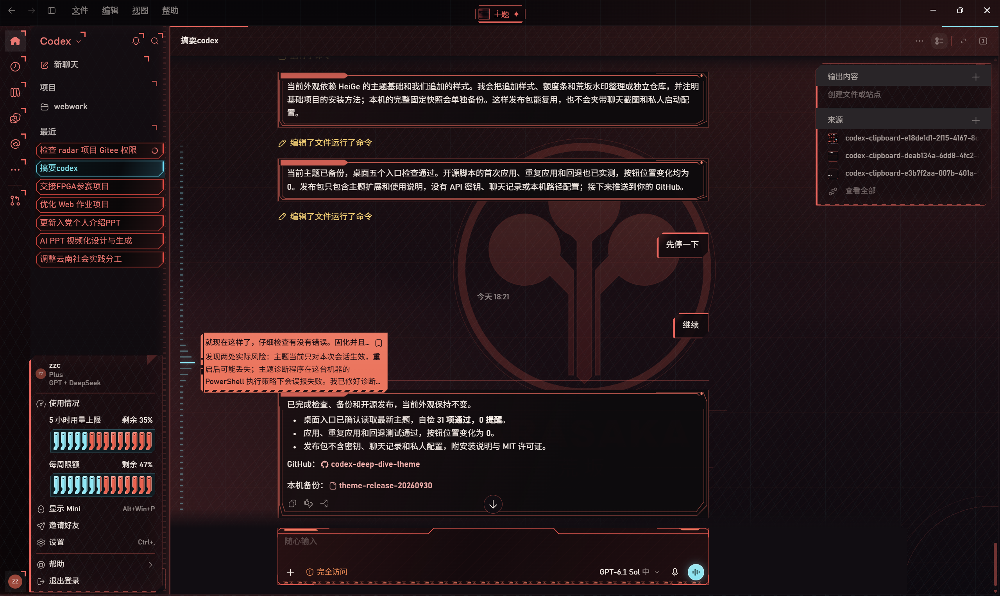

# Codex Deep Dive Theme · 深潜协议

为 Codex 桌面版制作的赛博朋克外观扩展：酒红与近黑背景、珊瑚红切角面板、青色选中状态、工业输入框、额度 RAM 分段条和荒坂风格背景水印。



以上为用户提供并授权发布的实际效果图，展示对话卡片、内容面板、输入框、背景水印和额度 RAM 条。实际界面取决于 Codex 版本、窗口大小和基础主题。

[查看设计示意图](docs/preview.svg)

## 能做什么

- 对话选项采用红黑切角卡片，选中、悬停和键盘聚焦时青色高亮。
- 对话导航刻度的悬浮预览采用珊瑚红机械面板。
- 底部输入框增加折线顶边、角部细线和三角警戒纹，不移动原生按钮。
- 助手回复框采用红黑信息面板，限制图片与放大按钮宽度，保留图片比例。
- 在原生中文/英文额度菜单可识别的 5 小时与每周“剩余百分比”下显示 14 格 RAM 条。
- 使用嵌入式 SVG 水印，不请求远程图片，不需要驻留后台服务。

这是**外观扩展**，不包含模型路由、API 密钥或模型切换功能。模型路由项目：[codex-multi-model-router](https://github.com/zczczzc431/codex-multi-model-router)。

## 安装与应用

要求：Node.js 22 或更新版本；已运行的 Codex 桌面版；仅绑定本机回环地址的 CDP 调试端口（默认 9341）。

1. 先按照 [HeiGeAi/heige-codex-skin-studio](https://github.com/HeiGeAi/heige-codex-skin-studio) 的说明安装并应用 `deep-dive-protocol` 基础主题，配置当前版本可用的本机调试入口。
2. 下载本仓库，或运行：

   ```powershell
   git clone https://github.com/zczczzc431/codex-deep-dive-theme.git
   cd codex-deep-dive-theme
   node scripts/theme.mjs check
   node scripts/theme.mjs status
   node scripts/theme.mjs apply
   ```

3. Windows 可以双击 `Apply Theme.cmd`。返回退出码 `0` 表示本次应用成功；报错时会显示原因。

不需要 `npm install`。自定义端口示例：`node scripts/theme.mjs apply --port=9341`。

脚本不会打开、关闭、重启或重新安装 Codex，也不会移动工作记录、修改 WindowsApps、app.asar 或签名文件。基础主题未激活时会拒绝应用，避免无意覆盖其他主题。

## 回退、重启与更新

```powershell
node scripts/theme.mjs remove
```

也可双击 `Remove Theme.cmd`。回退仅删除本扩展样式和额度条，保留基础主题。

本扩展使用当前窗口的运行时 CSS 注入。**Codex 重启或更新后需要重新应用**；桌面可为 `Apply Theme.cmd` 创建快捷方式。没有自动后台重注入，也不保证兼容尚未测试的新版本。

当前开发机验证版本：Codex Windows `26.928.1915.0`。更新后先运行 `status`，再运行 `apply`；入口或 DOM 变化导致报错时请提交 issue。该工具只连接 `app://-/index.html`，不会选择普通浏览器页面。启用调试端口时应仅允许回环访问，不应暴露给局域网或公网。

## 布局与可读性

装饰使用 CSS 背景与 `pointer-events: none` 的伪元素。原生输入、附件、模型按钮的位置不变；应用时会比较侧栏及输入区按钮矩形，变化超过 0.5px 时回退本扩展。回复图片宽度修复可能使回复高度减少，这是让图片完整适配内容框的预期结果。

额度条只读取界面里可识别的剩余百分比，不直接请求账户 API；无法识别的菜单条目不会生成额度条。它不是独立的用量统计服务。

## 文件与开发

- `theme/deep-dive.css`：发布用覆盖样式，内嵌水印。
- `theme/arasaka-watermark.svg`：水印的可编辑矢量源。
- `runtime/quota-ram.js`：额度条的 DOM 监听逻辑。
- `scripts/theme.mjs`：检查、状态、应用和回退，无第三方运行依赖。

修改 CSS 后先审核改动，再更新校验值：

```powershell
node -e "const fs=require('fs'),c=require('crypto');fs.writeFileSync('theme/deep-dive.css.sha256',c.createHash('sha256').update(fs.readFileSync('theme/deep-dive.css')).digest('hex'))"
node scripts/theme.mjs check
```

SVG 源修改后需同步 CSS 内嵌版本。发布包不包含开发机完整基础快照、聊天截图、日志、账户配置或 `.lnk` 快捷方式；第三方基础主题请从原项目获取。

## License / Credits

本仓库代码按 MIT 许可证发布。基础主题来自 [HeiGeAi/heige-codex-skin-studio](https://github.com/HeiGeAi/heige-codex-skin-studio)，并未在本仓库重新分发。

Cyberpunk 2077、Arasaka / 荒坂及相关名称属于其各自权利人；本项目是非官方风格扩展，与 OpenAI、CD PROJEKT RED 无关联。MIT 不授予第三方商标或游戏美术的权利。仓库里的水印为参考风格绘制的 SVG，不含用户提供的原始图片。
